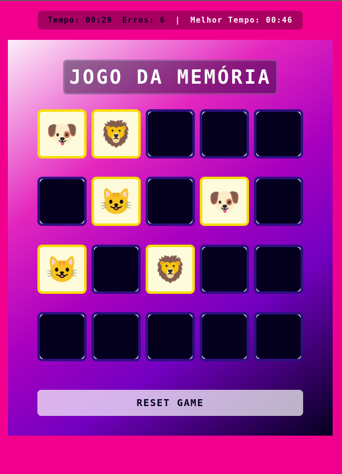

# Jogo da Memória

Este é um jogo da memória simples desenvolvido com HTML, CSS e JavaScript. O jogador deve combinar pares de cartas para ganhar o jogo. O jogo também inclui um cronômetro, um contador de erros e armazena o melhor tempo do jogador.

Foi desenvolvido para reproduzir o projeto visto na aula de Felipe Aguiar, Tech Educator na DIO. Foi modificado para completar o desafio DIO.

## Funcionalidades

- **Cronômetro**: Mostra o tempo em que o jogador está no jogo.
- **Melhor Tempo**: Salva o menor tempo registrado pelo jogador usando `localStorage`, permitindo o acompanhamento do recorde pessoal.
- **Contador de Erros**: Aumenta a cada tentativa incorreta, incentivando o jogador a melhorar sua precisão.
- **Botão Reset**: Reinicia o jogo e o cronômetro.

## Demonstração



## Tecnologias Utilizadas

- **HTML**
- **CSS**
- **JavaScript**

## Estrutura do Projeto

```markdown
.
├── index.html             # Estrutura HTML do jogo
├── src
│   ├── styles
│   │   ├── reset.css      # Reset de estilo
│   │   └── main.css       # Estilo principal do jogo
│   └── scripts
│       └── engine.js      # Lógica principal do jogo
└── README.md              # Documentação do projeto
